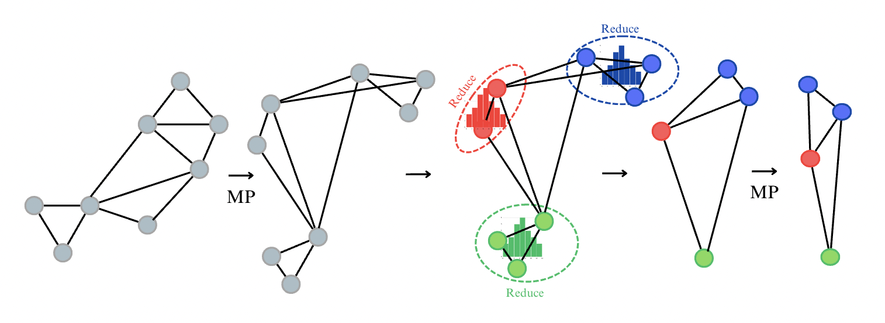

# Cluster-Sample-Pass (CSP). An Experimental GNN Architecture for Long-Range Graph Reasoning

Graph neural networks (GNNs) have achieved remarkable success with learning tasks on graph-structured data, yet challenges like oversquashing and oversmoothing limit their scalability to large graphs with long-range dependencies. This paper evaluates the Cluster Normalize Activate (CNA) architecture, designed to mitigate these issues, on the Long-Range Graph Benchmark (LRGB) datasets. Building on the results, we propose a novel architecture, Cluster Sample Pass (CSP), which integrates clustering, pooling, and probabilistic sampling to simplify graph structure while preserving critical information. CSP coarsens graphs by grouping nodes into clusters and sampling nodes from each cluster while retaining intra-cluster diversity. Subsequent GNN layers operate on the reduced graph, enabling scalable long-range dependency modeling. Experiments demonstrate that CSP improves computational efficiency and maintains competitive predictive performance, showing promise for addressing the limitations of current GNN architectures on complex graph tasks.\footnote{The source code is available under 

---



---

## Creating the Conda Environment

Follow these steps to set up a Conda environment and install the required dependencies for this project:  

1. **Clone the Repository**  
   ```bash
   git clone https://github.com/yzimmermann/Cluster-Reduce-Pass.git
   cd CSP
   ```

2. **Create the Conda Environment**  
   ```bash
   conda create -n CSP python=3.9 -y
   conda activate CSP
   ```

3. **Install Dependencies**  
   Use the provided `requirements.txt` file to install the necessary libraries:  
   ```bash
   pip install -r requirements.txt
   ```

4. **Verify Installation**  
   To ensure all dependencies are correctly installed, run:  
   ```bash
   python -c "import torch; import torch_geometric; print('Environment setup successful!')"
   ```

5. **Run the Code**  
   You can run any of the experiments mentioned in the paper by running the `main.py` file and referencing the desired config file. 
   - **The Config Files**
      - `struct-GCN.yaml` and `func-GCN.yaml` contain the configs for reproducing the SOTA results for the Peptides-struct and Petides-func datasets. Positional encoding can be added by setting `encoding: True`, default is False.
      - `struct-coarsening-GCN.yaml` and `func-coarsening-GCN.yaml` contain the configs for our newly proposed architecture.
      Modify the config file to change the parameters of the model. 

   - **Running the Code**
   ```bash
   python main.py --cfg configs/<config_file_name>
   ```
   
   Note: You can run only one data set at a time.

6. **CNA Comparison:**
   To run the CNA comparison have a look at the README: https://github.com/yzimmermann/Cluster-Reduce-Pass/blob/main/CNA_comparison/README.md
