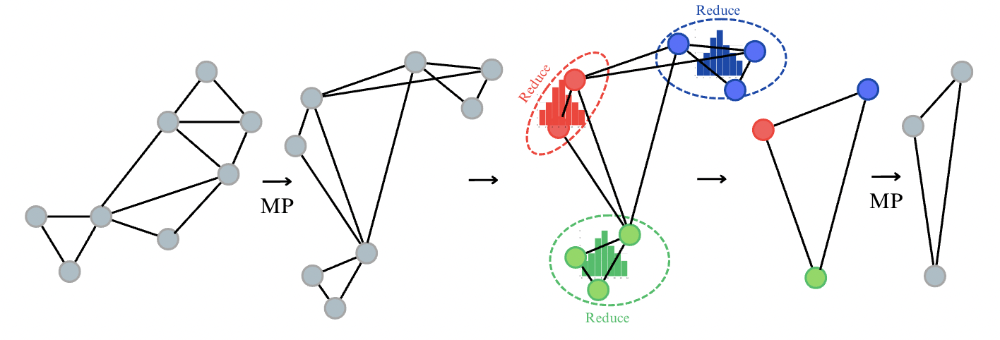

# Cluster-Reduce-Pass (CRP). An Experimental GNN Architecture for Long-Range Graph Reasoning

Graph Neural Networks (GNNs) have emerged as a powerful framework for learning on graph-structured data, achieving remarkable success across domains like molecular property prediction and recommender systems. However, GNNs face challenges such as oversquashing and oversmoothing, which hinder their scalability and effectiveness in large graphs with long-range dependencies.  

To address these issues, we introduce **Cluster, Reduce, Pass (CRP)**, a novel architecture that builds on existing clustering and graph coarsening techniques. CRP leverages clustering algorithms (e.g., KMeans, GMM) to group similar nodes into clusters, reducing graph complexity while preserving long-range dependencies. By iteratively applying coarsening and message-passing, CRP mitigates oversquashing and oversmoothing, offering an efficient and scalable solution for large-scale graphs.  

This repository contains the implementation of CRP, tested on two datasets from the Long Range Graph Benchmark (LRGB). The results are compared with the CNA architecture and state-of-the-art (SOTA) models reported on LRGB datasets.  

---



---

## Creating the Conda Environment

Follow these steps to set up a Conda environment and install the required dependencies for this project:  

1. **Clone the Repository**  
   ```bash
   git clone https://github.com/yzimmermann/Cluster-Reduce-Pass.git
   cd CRP
   ```

2. **Create the Conda Environment**  
   ```bash
   conda create -n CRP python=3.9 -y
   conda activate CRP
   ```

3. **Install Dependencies**  
   Use the provided `requirements.txt` file to install the necessary libraries:  
   ```bash
   pip install -r requirements.txt
   ```

4. **Verify Installation**  
   To ensure all dependencies are correctly installed, run:  
   ```bash
   python -c "import torch; import torch_geometric; print('Environment setup successful!')"
   ```

5. **Run the Code**  
   You can run any of the experiments mentioned in the paper by running the `main.py` file and referencing the desired config file. 
   - **The Config Files**
      - `struct-GCN.yaml` and `func-GCN.yaml` contain the configs for reproducing the SOTA results for the Peptides-struct and Petides-func datasets. Positional encoding can be added by setting `encoding: True`, default is False.
      - `struct-coarsening-GCN.yaml` and `func-coarsening-GCN.yaml` contain the configs for our newly proposed architecture.
      Modify the config file to change the parameters of the model. 

   - **Running the Code**
   ```bash
   python main.py --cfg configs/<config_file_name>
   ```
   
   Note: You can run only one data set at a time.

6. **CNA Comparison:**
   To run the CNA comparison have a look at the README: https://github.com/yzimmermann/Cluster-Reduce-Pass/blob/main/CNA_comparison/README.md
